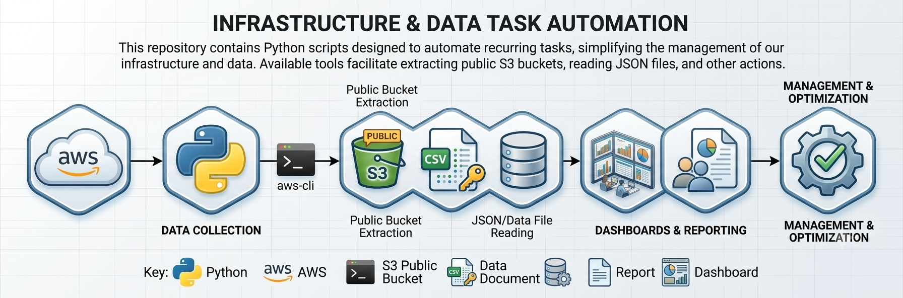

# Python scripts
This repository contains Python scripts designed to automate recurring tasks. Among the available functionalities, you can extract public S3 buckets, read JSON files, and perform other actions that simplify management and automation of processes related to our infrastructure and data.



### Requirements
- Python 3.10+
- Pip
- Database and cloud credentials (AWS, MongoDB, MySQL, PostgreSQL, Redis, SQL Server)

### Install dependencies
```bash
pip install pymongo pymysql psycopg2-binary redis pyodbc PyJWT boto3
```

### Structure
└─ `README.md`  
└─ `generate-random-password.py`  
└─ `generate-token/generate-token.py`  
└─ `ses-aws/ses.py`  
└─ `db-test-connection/mongodb-test-connection.py`  
└─ `db-test-connection/mysql-test-connection.py`  
└─ `db-test-connection/postgres-test-connection.py`  
└─ `db-test-connection/redis-test-connection.py`  
└─ `db-test-connection/sqlserver-test-connection.py`

### Comments
- Key generator: https://randomkeygen.com/

### Quick usage

Generate random password:
```
python generate-random-password.py
```

Generate JWT token:
```
python generate-token/generate-token.py
```

Send test email with AWS SES:
```
python ses-aws/ses.py
```

#### Test database connection scripts

MongoDB:
```
python db-test-connection/mongodb-test-connection.py
```

MySQL:
```
python db-test-connection/mysql-test-connection.py
```

Redis:
```
python db-test-connection/redis-test-connection.py
```

PostgreSQL:
```
python db-test-connection/postgres-test-connection.py
```

SQL Server:
```
python db-test-connection/sqlserver-test-connection.py
```

### Environment variables (recommended)
Several scripts currently include credentials directly in code. It is recommended to move them to environment variables before production use.

Example `.env`:
```env
# AWS
AWS_ACCESS_KEY_ID=replace_with_your_access_key
AWS_SECRET_ACCESS_KEY=replace_with_your_secret_key
AWS_REGION=us-east-1

# MongoDB
MONGO_HOST=localhost
MONGO_PORT=27017
MONGO_DB=agus-test

# MySQL
MYSQL_HOST=your-rds-endpoint.amazonaws.com
MYSQL_PORT=3306
MYSQL_USER=your_username
MYSQL_PASSWORD=your_password
MYSQL_DB=your_database_name

# PostgreSQL
POSTGRES_HOST=localhost
POSTGRES_PORT=5432
POSTGRES_USER=your_user
POSTGRES_PASSWORD=your_password
POSTGRES_DB=your_database

# Redis
REDIS_HOST=localhost
REDIS_PORT=6379
REDIS_PASSWORD=

# SQL Server
SQLSERVER_HOST=localhost
SQLSERVER_USER=admin
SQLSERVER_PASSWORD=your_password
SQLSERVER_DB=your_database

# JWT
JWT_SECRET=replace_with_secret
```